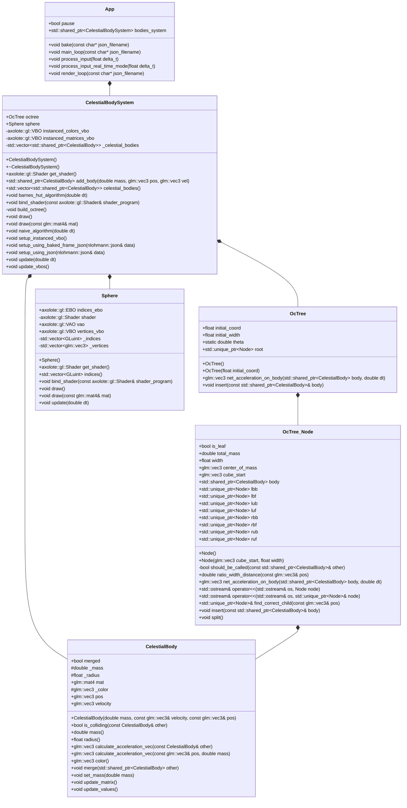

# nbody-simulation
N-Body simulation using Axolote Engine

## Dependencies
* CMake
* OpenGL
* GLM
* GLFW3
* Doxygen (Optional)
* Axolote Engine. See [https://github.com/JotaEspig/axolote-engine](https://github.com/JotaEspig/axolote-engine) 

## Compiling
```bash
git clone https://github.com/JotaEspig/nbody-simulation.git
cd nbody-simulation
cmake .
make -j4
```
You need to install [Axolote Engine](https://github.com/JotaEspig/axolote-engine) to run it.
```bash
chmod +x install_axolote.sh
./install_axolote.sh
```

## Running
After compiling
```bash
./bin/nbody-simulation <config json file>
```

There are some config files already made inside `config` directory. But you can create your custom config file using:
```bash
python3 scripts/config_generator.py
```

### Keybinds

* `W`, `A`, `S`, `D`, `LEFT_SHIFT`, `SPACE` to move the camera around the focus point (default is (0, 0, 0))
* `UP`, `DOWN`, `LEFT`, `RIGHT`, `RIGHT_SHIFT`, `RIGHT_CONTROL` to move the focus point
* `R` to reset the camera position and set the focus point to be (0, 0, 0)
* `P` to pause the simulation
* `X` to throw a "semi" massive body where the camera is pointing (WHEN DOING REAL TIME SIMULATION)
* `ESC` to quit/close the window

## Documentation
You can generate the documentation using Doxygen
```bash
make docs
```
Then open `docs/html/index.html` with your browser.

## Class Diagram (may be outdated)
[Diagram](docs/diagram.png)

